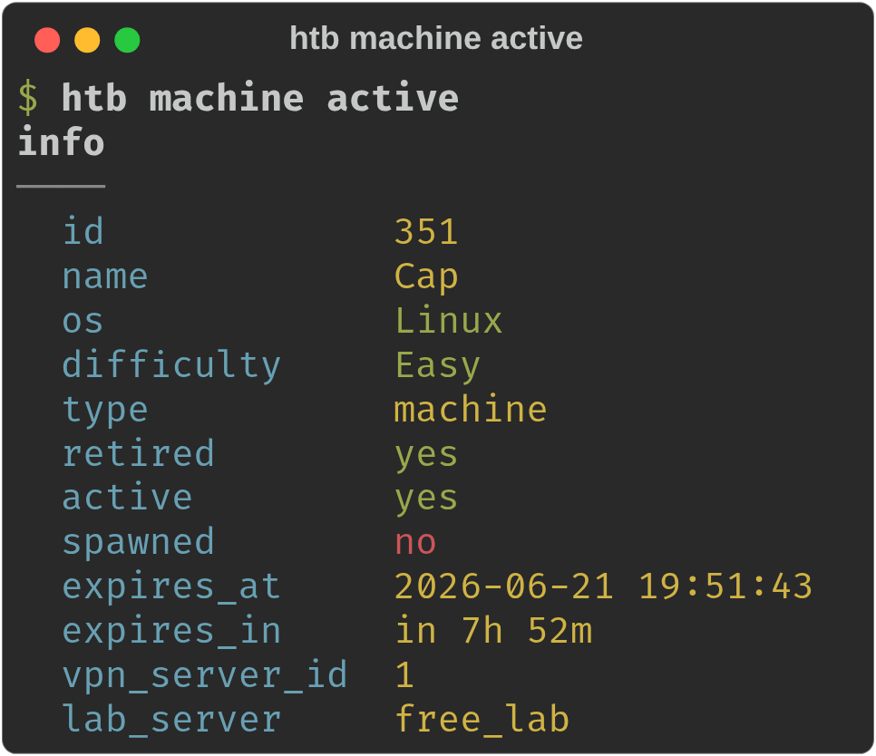
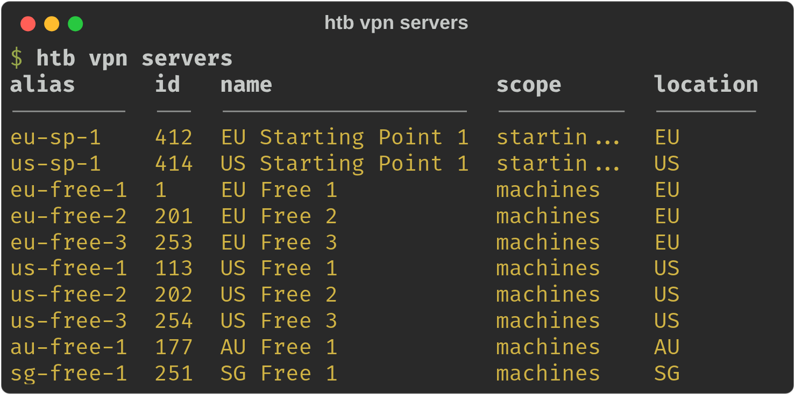
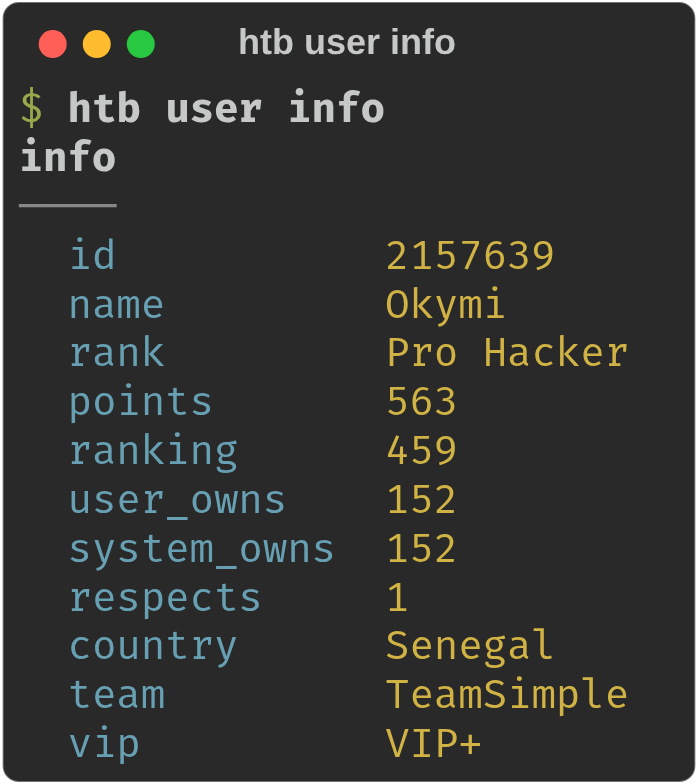
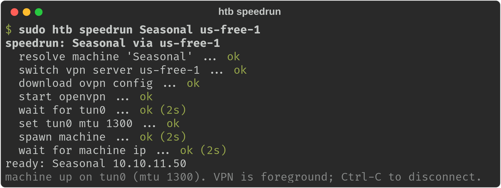
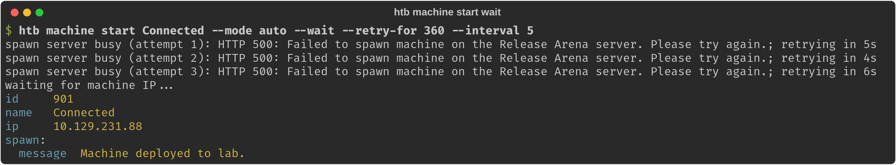

# htb-terminal

[](https://github.com/Okymi-X/htb-terminal/actions/workflows/ci.yml)
[](https://www.python.org/)
[](LICENSE)

Python terminal client for selected HTB Labs v4 API workflows:
machines, VPN, OVPN files, and raw API calls. Zero external dependencies.

See the [command reference](docs/commands.md) for every command, option,
default, and the API endpoint each command calls.

## Sources

- Official HTB Enterprise Public API documentation: https://enterprise-help.hackthebox.com/en/articles/13375637-introduction-to-enterprise-public-api
- Official HTB article on Lab/OpenVPN access: https://help.hackthebox.com/en/articles/5185687-gs-introduction-to-lab-access
- v4 Postman collection: https://documenter.getpostman.com/view/13129365/TVeqbmeq
- Readable community reference for Labs v4 endpoints: https://github.com/D3vil0p3r/HackTheBox-API

Note: HTB officially documents the Enterprise API. The Labs v4 endpoints used here come from the Postman collection and community references; they may change without notice.

## Screenshots

Compact active-machine output keeps the session details and profile-only status text readable without dumping the full HTB profile.



`machine active --oneline` collapses that into a single status line.


Tables use compact columns, terminal colors, and truncation by default. Use `--wide` when you need full values.



`user info` shows your rank, points, and owns at a glance.



`speedrun` shows a live, per-step status while it connects the VPN, sets the MTU, and spawns the machine.



These images are generated with `scripts/screenshots.py` (see [Regenerating screenshots](#regenerating-screenshots)).

## Installation

Requires Python 3.10+. This project has no external dependencies.

Install as a global command with [pipx](https://pipx.pypa.io) (recommended) so
`htb` is available from any directory:

```bash
pipx install htbx
htb --help
```

Or with pip:

```bash
pip install htbx
htb --help
```

The package is published on PyPI as **`htbx`**; it installs the `htb` command
(an `htbx` alias is installed too). To run the latest from source without
installing, use a clone:

```bash
chmod +x ./htb
./htb --help
```

### Authentication

Generate an App Token from your HTB profile settings, then save it once with
`init`:

```bash
htb init
# Paste your HTB App Token (input hidden): ...

htb init --check   # also verify the token and print who you are
```

`init` stores the token in your user config directory
(`~/.config/htb-terminal/token`, or `$XDG_CONFIG_HOME/htb-terminal/token`) with
owner-only permissions, so a pipx-installed `htb` finds it from anywhere. You
can also pass it non-interactively:

```bash
htb init --token "$MY_TOKEN"
echo "$MY_TOKEN" | htb init
```

The token is resolved in this order, first match wins:

1. `HTB_API_TOKEN` environment variable.
2. `--token-file PATH`, when given.
3. `./api.token` in the current directory (handy as a per-project override).
4. The user config file written by `htb init`.

`api.token` is gitignored; never commit your token.

## Examples

Full details for each command are in the [command reference](docs/commands.md).

```bash
./htb machine active
./htb machine profile "BoardLight"
./htb machine list
./htb machine list --retired --page 1
./htb machine list --sp-tier 1
./htb machine search board
./htb machine search kerberos --all --limit 10
./htb machine search "breach creds" --all --profiles

./htb machine start "BoardLight" --mode auto
./htb machine start 444 --mode play
./htb machine start 478 --mode spawn

# Seasonal release: keep retrying a full spawn server, then wait for the IP.
./htb machine start Nimbus --mode auto --wait --retry-for 360 --interval 5

./htb machine stop
./htb machine reset
./htb machine extend
./htb machine submit 444 HTB{flag} --difficulty 50
./htb machine active --oneline

./htb user info

./htb vpn servers
./htb vpn switch us-free-1
./htb vpn download us-free-1 -o lab-vpn.ovpn
./htb vpn connect us-free-1 -o lab-vpn.ovpn

# Speedrun a seasonal release: connect VPN, set MTU 1300, spawn, wait for IP.
sudo htb speedrun Seasonal us-free-1

./htb raw GET /machine/active
./htb raw POST /vm/spawn --data '{"machine_id":478}'
```

## Output

By default, commands print human-readable output with terminal-width wrapping and automatic color when stdout is an interactive terminal.

Use raw JSON for scripts:

```bash
./htb --json machine active
```

Color can be controlled globally:

```bash
./htb --color never machine active
./htb --color always machine list
```

Tables are compact by default and truncate long cells to fit common terminal widths. Use `--wide` to keep full table values:

```bash
./htb --wide machine list
./htb --wide machine search active-directory --all
```

`machine active` enriches the active session response with the matching machine profile when a machine is active, but prints a compact summary by default. The summary includes useful profile-only text such as `info_status` and `description` when HTB returns it. Use `--details` for synopsis and Academy module names, or `--json` before the command for the full enriched response:

```bash
./htb machine active --details
./htb --json machine active
```

## Machine search

`machine search` intentionally uses the documented/listed Labs v4 machine list endpoints and filters the results locally. It does not depend on an undocumented search endpoint.

By default it scans playable machines:

```bash
./htb machine search linux
```

Useful options:

- `--retired`: search retired machines only.
- `--all`: search playable and retired machines.
- `--profiles`: also fetch each scanned machine profile and search profile-only fields such as descriptions.
- `--limit N`: stop after printing up to `N` matches.
- `--max-pages N`: cap the number of API pages scanned per list.

Without `--profiles`, the query matches machine id, name, OS, difficulty, tags, maker names, and common list fields. Use `--profiles` for terms that may only exist in the detailed machine profile, for example description text mentioning breached credentials.

## Spawn a seasonal box with `--wait`

When a seasonal machine drops (Saturdays 19:00 UTC) the spawn servers are full,
so a plain `machine start` fails immediately with a capacity error. If you are
already connected to the VPN, add `--wait` to keep retrying until a slot frees
up and then block until the machine reports its IP:

```bash
./htb machine start Connected --mode auto --wait --retry-for 360 --interval 5
```



- `--retry-for SECONDS`: total time to keep retrying the spawn (default 600).
- `--interval SECONDS`: base delay between spawn attempts and IP-availability
  polls; each spawn delay is jittered ±20% so simultaneous clients do not retry
  in lockstep at the release moment.

Only transient rejections are retried — capacity messages (`full`, `busy`,
`try again`, …) and `429`/`5xx` responses, including the Release Arena's
"Failed to spawn … Please try again." Real failures (bad token, unknown
machine) fail fast instead of spinning for minutes. For the full hands-off flow
that also connects the VPN and tunes the MTU, use `speedrun` below.

## Speedrun a season release

When a seasonal machine drops (Saturdays 19:00 UTC), the slow part is the manual
dance of connecting the VPN, fixing the tunnel MTU, and spamming spawn until a
slot frees up. `speedrun` does all of it in one command and shows a live,
emoji-free status for each step:

```bash
sudo htb speedrun Seasonal us-free-1
```

```
speedrun: Seasonal via us-free-1
  resolve machine 'Seasonal' ... ok
  switch vpn server us-free-1 ... ok
  download ovpn config ... ok
  start openvpn ... ok
  wait for tun0 ... ok (3s)
  set tun0 mtu 1300 ... ok
  spawn machine ... ok (42s)
  wait for machine ip ... ok (18s)
ready: Seasonal 10.10.11.50
```

It needs root (for OpenVPN and the MTU change), so run it with `sudo`. The VPN
runs in the foreground; press Ctrl-C to disconnect. Tunables: `--mtu`,
`--interface`, `--retry-for`, `--interval`, `--mode`, and `--variant`.

## Shell completion

Enable tab-completion for commands, subcommands, and options. The same script
works for both the `htb` and `htbx` commands.

```bash
# bash — add to ~/.bashrc:
eval "$(htb completion bash)"

# zsh — add to ~/.zshrc (before compinit, or save to a file on your $fpath):
eval "$(htb completion zsh)"
```

## Architecture

- `htb_terminal/cli.py`: thin entry point — dispatch and error rendering.
- `htb_terminal/parser.py`: argparse definitions, one builder per command group.
- `htb_terminal/handlers.py`: command handlers (args + client -> result).
- `htb_terminal/config.py`: loads/saves the token and API URL.
- `htb_terminal/http.py`: authenticated HTTP client.
- `htb_terminal/output.py`: human-readable and JSON rendering.
- `htb_terminal/ui.py`: `StepRunner` live step status for workflows.
- `htb_terminal/netcfg.py`: host network/process ops (OpenVPN, interface, MTU).
- `htb_terminal/timefmt.py`: relative time formatting for display.
- `htb_terminal/completion.py`: bash/zsh completion scripts from one command map.
- `htb_terminal/services/machines.py`: `MachineService` — machine API operations.
- `htb_terminal/services/user.py`: `UserService` — current-user profile.
- `htb_terminal/services/speedrun.py`: `SpeedrunService` — season-release flow.
- `htb_terminal/services/payloads.py`: pure helpers that reshape machine-list JSON.
- `htb_terminal/services/search.py`: local machine search and result ranking.
- `htb_terminal/services/spawn.py`: transient spawn-failure detection.
- `htb_terminal/services/vpn.py`: VPN and OVPN operations.

Each module keeps a single responsibility to make future changes easier if HTB
changes an endpoint. `MachineService` only talks to the API; payload reshaping,
search ranking, and spawn-error detection are stateless modules it composes, so
they are testable in isolation and stay small.

## Regenerating screenshots

The images in `docs/screenshots/` are produced by `scripts/screenshots.py`,
which renders each command's output to SVG with `rich` and screenshots it with a
headless Chromium — no PTY needed, so it works on CI and remote boxes:

```bash
python3 scripts/screenshots.py                 # capture all shots
python3 scripts/screenshots.py vpn-servers speedrun   # capture a subset
```

Commands that hit the API need a saved token (`htb init`); the `machine active`
shots need an active machine. The `speedrun` and `machine-start-wait` shots use
the fixed demos `scripts/demo_speedrun.py` and `scripts/demo_seasonal_start.py`,
which render a realistic status with no token, root, or network.

## Development

Install the dev tools and run the test suite:

```bash
pip install -e ".[dev]"
pytest
ruff check .
```

The tests are also runnable with the standard library alone:

```bash
python3 -m unittest discover -s tests -v
```

## License

MIT — see [LICENSE](LICENSE).
